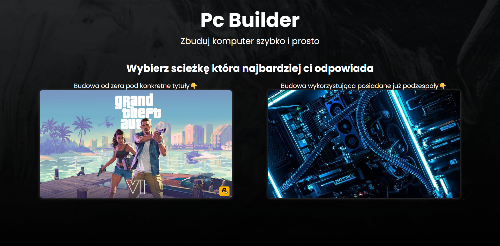
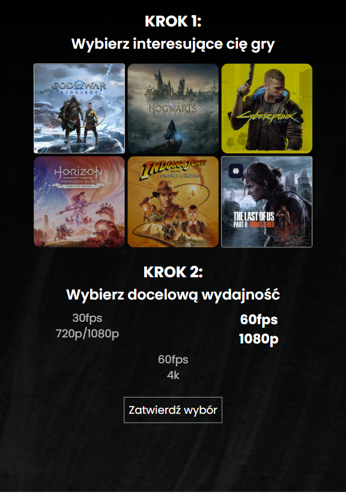
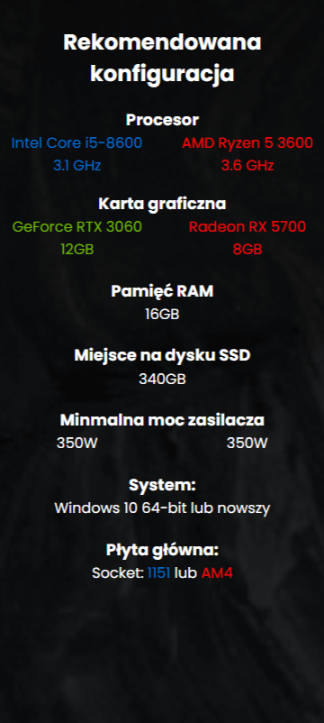

# 🖥️ PCBuilder – Konfigurator zestawów komputerowych

Aplikacja webowa umożliwiająca budowę zestawu komputerowego w oparciu o wybrane gry lub już posiadane podzespoły. Użytkownik otrzymuje rekomendację dwóch dopasowanych konfiguracji – na platformie NVIDIA/Intel oraz AMD/Radeon.


## 🔗 Demo

👉 [Zobacz na żywo](https://dawidkuczma-dev.github.io/pcbuilder/)

## 📸 Screenshots

<p align="center">
  
  
  
</p>


## ⚙️ Technologie

- HTML5
- SCSS (Sass)
- JavaScript (Vanilla)
- JSON – dane gier i komponentów (opcjonalnie: API w przyszłości)

## 📁 Struktura folderów

```bash
📁 PcBuilder
├── 📁 assets
|   ├── 📁 data
|   |   ├── components.json
│   |   └── games.json
│   └── 📁 images
│       ├── GoW.jpg
│       ├── bg-desktop.png
│       └── ...
├── 📁 css
│   └── main.css
├── 📁 js
│   ├── components-selection.js
│   └── scroll.js
├── 📁 scss
│   ├── _base.scss
│   ├── _introduction.scss
│   └── ...
├── index.html
└── README.md

📁 assets/data – dane komponentów oraz wymagań gier
📁 assets/images – zawiera zrzuty ekranu, tła, zdjęcia gier i komponentów  
📁 js – skrypty odpowiedzialne za dopasowanie komponentów do wymagań gier oraz za obsługę przewijania strony
📁 scss – pliki źródłowe stylów (moduły SCSS)  
📁 css – skompilowany plik stylów dla strony

```

## ✨ Funkcje

- 🎮 Ścieżka oparta na grach
  - Wybierz jedną lub więcej popularnych gier
  - Określ oczekiwaną wydajność (płynność / jakość grafiki)
  - Otrzymaj dwa sugerowane zestawy:
      - ✅ Intel + NVIDIA
      - ✅ AMD + Radeon
- 🧩 Ścieżka oparta na posiadanych komponentach (w trakcie tworzenia)
  - Podaj komponenty, które już posiadasz
  - Zbuduj zestaw wokół istniejących części
  - Ograniczenie budżetu i kompatybilność podzespołów

## 🧠 Czego się nauczyłem

- Tworzenie interfejsu prowadzącego krok po kroku (wizard)
- Obsługa wyborów zależnych i dynamicznego generowania rekomendacji
- Praca z danymi komponentów i ich porównywaniem
- Planowanie rozszerzalnej architektury frontendowej

## 📈 Plany na przyszłość
- Dokończenie ścieżki z posiadanymi komponentami
- Zapis do LocalStorage (lub export PDF)
- Integracja z API sklepów (np. Ceneo, Morele)
- Automatyczna wycena zestawów
- Możliwość edycji rekomendowanego zestawu

## 🚀 Uruchomienie lokalne

1. Sklonuj repozytorium  
```bash
git clone https://github.com/DawidKuczma-dev/pcbuilder.git
```
2. Otwórz plik `index.html` w przeglądarce lub uruchom lokalny serwer (np. Live Server)

## 📇 Autor

Dawid Kuczma  
[LinkedIn](https://www.linkedin.com/in/dawid-kuczma-a60836369/) • [GitHub](https://github.com/DawidKuczma-dev)

## 📝 Licencja

Ten projekt jest dostępny na zasadach licencji MIT.


